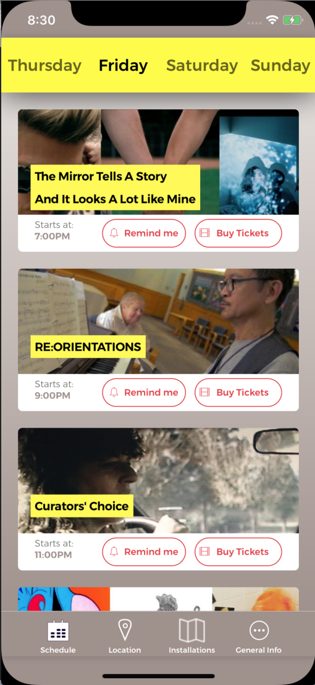

  
# mix-30
A mobile app that allows users to explore, schedule and get to the 30th MIX Film Festival

### How to Download Mix30:
apple app store-->
[https://itunes.apple.com/us/app/mix-30-film-festival/id1361611744](https://itunes.apple.com/us/app/mix-30-film-festival/id1361611744)

google play store-->
[https://play.google.com/store/apps/details?id=com.mix30.festival](https://play.google.com/store/apps/details?id=com.mix30.festival)

### Running Mix30 on Your Computer:
You can clone this repo and run it on your Mac OS device using the script "react-native run-ios" or "react-native run-android". Node.js and npm must be installed. For more information on running an app created with create-react-native-app, visit [create-react-native-app on GitHub](https://github.com/react-community/create-react-native-app).

### How To Use MIX 30 Festival App:
Navigate between tabs to explore the festival schedule, the artists and installations, the location and directions, and more general information.

### Technology Stack:
* React Native (via create-react-native-app)
* Expo
* Redux
* Redux Persist
* Sentry
* React Navigation

### Created and developed by:
[Gabriel DeFazio](https://github.com/gabrieldefazio)
# mix30
